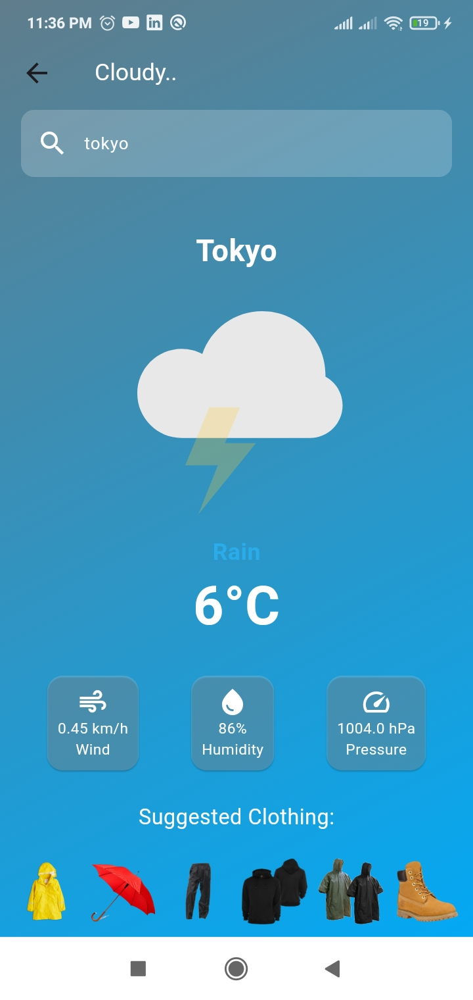

 # &#128640; **Cloudify** - A weather App :dizzy:

# :snowflake:  :zap:   :sun_with_face:

## :spades: Introduction
---

Cloudify is a modern and user-friendly mobile application designed to provide real-time weather
information along with practical clothing suggestions based on the current weather conditions.
Built using Flutter, a powerful framework for cross-platform mobile development, Cloudify offers
a seamless experience for users on both Android and iOS platforms.

The app leverages an external weather API (e.g., OpenWeatherMap) to fetch accurate and up-to-
date weather data, including temperature, weather conditions, and city names. One of the standout
features of Cloudify is its clothing suggestion system, which recommends appropriate attire based
on the current weather. This feature makes the app not only informative but also highly practical
for everyday use.
Additionally, Cloudify enhances the user experience with dynamic backgrounds and animations
that change according to the weather conditions. For example, a sunny day displays a bright, warm
background with a sun animation, while a rainy day shows a dark, moody background with rain
animations. These visual elements make the app engaging and visually appealing

# :football: Objectives
The primary objectives of the Cloudify project are:

- :white_check_mark: Provide Real-Time Weather Data:-
 Fetch and display accurate weather information, including temperature, weather
conditions, and city name.
 Ensure the app updates weather data in real-time.

 - :white_check_mark: Clothing Suggestions:
 Offer users practical clothing recommendations based on the current weather
conditions.
 Provide a unique feature that sets Cloudify apart from other weather apps.
- :white_check_mark: Dynamic User Interface:
 Create a visually appealing and interactive user interface with dynamic
backgrounds and animations that reflect the weather conditions.
 Ensure the app is visually engaging and easy to navigate.
- :white_check_mark: User-Friendly Design:
 Design an intuitive and simple user interface with a focus on ease of use.
 Include a search feature that allows users to easily find weather information for any
location.

---

